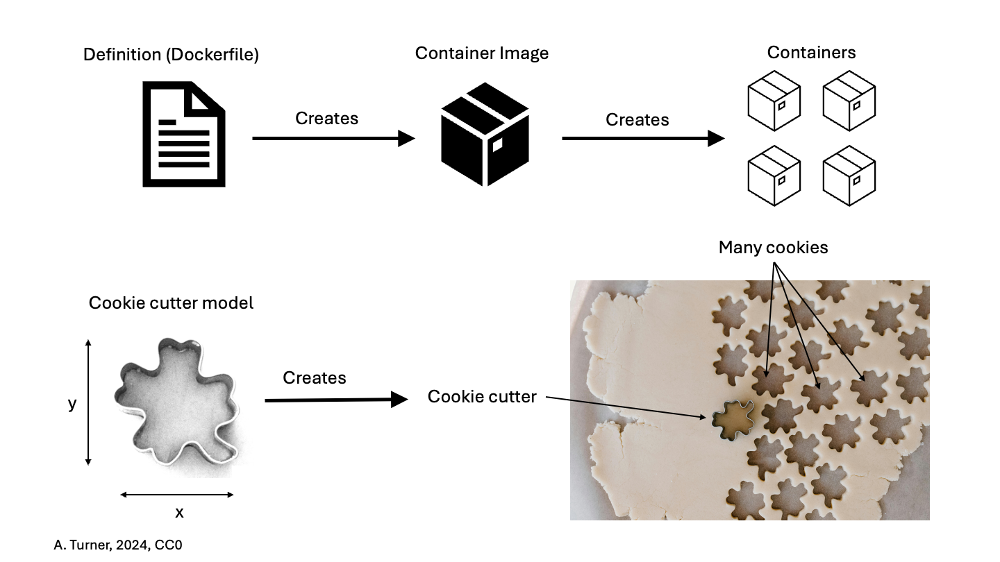

# Reproducible analysis with R

Lucille Delisle

2025/03/18

---

# Who am I?

Lucille Delisle

PhD in biology

Bioinformatician since 2015

50% in Andrey lab and 50% in Herrera lab since March 2025

Highly motivated by open data open software open trainings

---

# Who are you?

- Who is your PI?

- Are you PhD? Post-doc/Collab? Master? Other?

- What is your bioinformatic level?
    - None (never used R never used command lines)
    - Beginner (used a bit of R)
    - Intermediate (At ease with R)
    - Advanced (At ease with R and command lines but want to know about reproducibility)
    - Expert (At ease with R and command lines and containers)

---

# Schedule

- Theorical part

- Hands-on

- Free part

---

# Reproducibility

Start from the same input data and be able to rerun the analysis to the figure/tables.

What is needed:

- input data
- scripts (should be stored in git)
- and???

---

# Reproducibility

Start from the same input data and be able to rerun the analysis to the figure/tables.

What is needed:

- input data
- scripts (should be stored in git)
- tool versions (R + all packages used)

---

# How to manage tool versions

Issues:
    - you may have multiple projects on going
    - you may want to collaborate on a project
    - you cannot reproduce results
    - you want to install a new packages

I think the solution is "Containers"

---

### What are containers?

I've been inspired by: [SIB course material](https://sib-swiss.github.io/containers-introduction-training/latest/) and [Carpentries course](https://carpentries-incubator.github.io/docker-introduction/).

Containers are:
- Virtualized environment: an isolated file system accessible from a host computer
- Other than virtual machines (VMs), containers have specific purposes, and carry only essential information to perform their task
- In IT terms:
  - containers share the kernel with the host OS
  - VMs bring the entire operating system

---

### Important vocabulary

<!--  -->
<!--  -->
<!--  -->

<!--  -->

Developers write a **Dockerfile** (how to make a cookie cutter). You can see examples on [my github](https://github.com/lldelisle/lldelisle-docker)

They run on their computer or on the cloud a command that generates a **Container Image** (you build the cookie cutter). This image is then published for example on dockerhub.

---

### Important vocabulary

<!--  -->
<!--  -->
<!--  -->

<!--  -->

Everyone can then download this image on its computer or on any server and then can create multiple **containers** (cookies).

You can personalize each cookie but then you loose the reproducibility. 
It is better to modify the Dockerfile -> image -> container

Container has a short life so don't spend time on customizing something that will last so shortly...

---

### What means 'isolated' in 'isolated file system'?

By default there in no communication between what is on your computer and what is in your container.

If you want to have access in your container to files in your computer, you need to specify before which are the directories which will be 'mounted'.

---

## Application to RStudio server

---

### R packages

#### Origin

R packages can have 3 origins:
- CRAN (The Comprehensive R Archive Network): 21599 available packages. Any package of good quality (documentation + tests) can go to CRAN. Each developer deals with the releases of its own package.
- Bioconductor: 2300 packages which are manually reviewed and related to biology. There are release cycles every 6 months that ensure that at a fixed release (for example Bioconductor release 3.19) all packages are compatible and work together. The releases are attached to R version: Bioconductor releases 3.17, 3.18 require R version 4.3, Bioconductor releases 3.19, 3.20 requires R version 4.4.
- Github

---

#### Dependencies

Some R packages have no dependencies (they only use basic R functions). Most of them have dependencies from other packages and requires a minimal version of these packages. Some of them depends not only R packages but requires some system libraries to be able to compile a code (written in C or in Fortran for example) to speedup the calculations.

---

### Current situation for people already using R

#### Local RStudio

Everyone has RStudio on its laptop with fixed R version, fixed version of softwares. Sometimes you find your R too old or you need to upgrade a package because you want to use another package but which is not compatible with the old one or you want to use a new functionality... And you have some RDS files from previous version so you use them and then Lucille arrives and say you need to use the same version from start to end...

#### R on HPC?

Not necessarily the same version as what you have on your computer. Modules may not be updated as fast as necessary...

---

### Docker vs Singularity/Apptainer

Docker is the most popular container software. It has a GUI on Linux, MacOS and Windows. It is great for container development. It offers a large repository (docker hub) with a lot of base images including ubuntu, rstudio server... It requires administration access which is not possible for shared servers. So you can use docker on your laptop (see [this section](#use-on-your-computer-the-same-image-as-you-are-using-on-the-server)).

Singularity was the name of the original project but disagreement between the founder and the developers lead to two different projects: one adopted to the Linux Foundation changed its name to Apptainer while SingularityCE is the second one still developped at Sylabs. Apptainer/Singularity work without administration access. Image files are '.sif' (a file format develpped by SingularityCE). You can easily create a '.sif' from a docker image (and this is what most of developpers do). So on servers/linux/WSL2 we can use apptainer.
