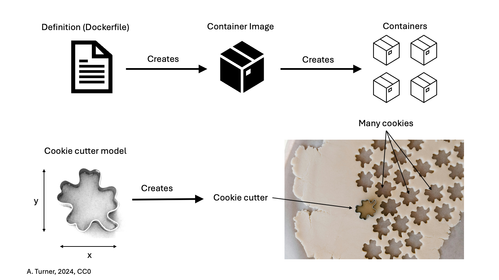
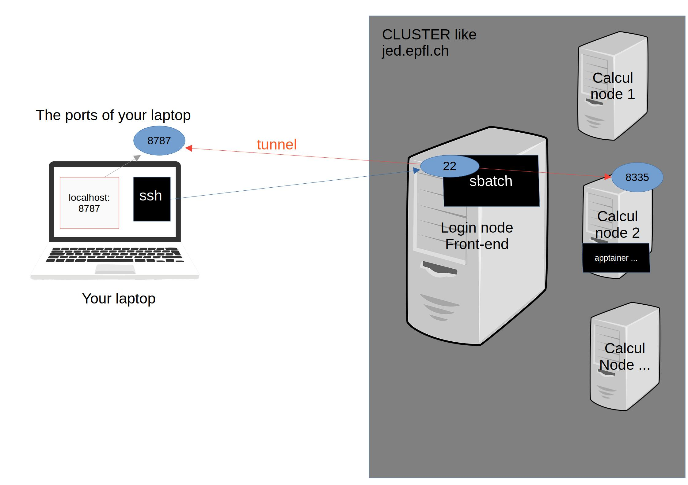

# Containers
<!-- TOC -->

- [General intro](#general-intro)
    - [Why?](#why)
    - [What are containers?](#what-are-containers)
    - [Important vocabulary](#important-vocabulary)
    - [What means 'isolated' in 'isolated file system'?](#what-means-isolated-in-isolated-file-system)
- [Application to RStudio server](#application-to-rstudio-server)
    - [R packages](#r-packages)
        - [Origin](#origin)
        - [Dependencies](#dependencies)
    - [Current situation](#current-situation)
        - [Local RStudio](#local-rstudio)
        - [RStudio server](#rstudio-server)
    - [Docker vs Singularity/Apptainer](#docker-vs-singularityapptainer)
    - [Hands-on](#hands-on)
        - [Connect using ssh without password](#connect-using-ssh-without-password)
            - [Setup a public key for your computer](#setup-a-public-key-for-your-computer)
            - [Put it into the distant server](#put-it-into-the-distant-server)
        - [To run on RStudioserver on galaxyduboule.epfl.ch with one script](#to-run-on-rstudioserver-on-galaxydubouleepflch-with-one-script)
        - [To run on RStudioserver on SCITAS and adapt to other clusters with one script](#to-run-on-rstudioserver-on-scitas-and-adapt-to-other-clusters-with-one-script)
        - [To run RStudioserver on UNIGE using open-on-demand service](#to-run-rstudioserver-on-unige-using-open-on-demand-service)
        - [Step-by-step: Connect using ssh to the server of your choice and prepare everything](#step-by-step-connect-using-ssh-to-the-server-of-your-choice-and-prepare-everything)
        - [View RStudio server on your computer](#view-rstudio-server-on-your-computer)
        - [Remember you are on a container](#remember-you-are-on-a-container)
        - [New package installations](#new-package-installations)
            - [On galaxyduboule](#on-galaxyduboule)
            - [On SCITAS](#on-scitas)
    - [Available images](#available-images)
    - [Use on your computer the same image as you are using on the server](#use-on-your-computer-the-same-image-as-you-are-using-on-the-server)
    - [Reproduce your installation of RStudio server like it is on galaxyduboule.epfl.ch:](#reproduce-your-installation-of-rstudio-server-like-it-is-on-galaxydubouleepflch)
        - [Get everything ready](#get-everything-ready)
        - [Install packages](#install-packages)
- [Other applications](#other-applications)

<!-- /TOC -->
<!-- /TOC -->
## General intro

### Why?

The more I think about it the more I think this is the best way to do reproducible science and be able to have parallel projects without being stuck in an old version of a software. This is already used in galaxy (not on galaxyduboule because I had not enough time to set it up) and I really think this should be used for RStudio server.

### What are containers?

I've been inspired by: [SIB course material](https://sib-swiss.github.io/containers-introduction-training/latest/) and [Carpentries course](https://carpentries-incubator.github.io/docker-introduction/).

Containers are:
- Virtualized environment: an isolated file system accessible from a host computer
- Other than virtual machines (VMs), containers have specific purposes, and carry only essential information to perform their task
- In IT terms:
  - containers share the kernel with the host OS
  - VMs bring the entire operating system

### Important vocabulary



Developers write a Dockerfile (how to make a cookie cutter). You can see examples on [my github](https://github.com/lldelisle/lldelisle-docker).

They run on their computer or on the cloud a command that generates a Container Image (you build the cookie cutter). This image is then published for example on dockerhub.

Everyone can then download this image on its computer or on any server and then can create multiple containers (cookies).

You can personalize each cookie (remove one part with a knife, paste a bit of daw to make it larger) but then you loose the reproducibility so as much as possible it is better to modify the Dockerfile, regenerate an image and create a container from the new image. Also remember that the container has a short life usually hours so you may not want to spend time on customizing something that will last so shortly...

### What means 'isolated' in 'isolated file system'?

By default there in no communication between what is on your computer and what is in your container.

If you want to have access in your container to files in your computer, you need to specify before which are the directories which will be 'mounted'.

## Application to RStudio server

### R packages

#### Origin

R packages can have 3 origins:
- CRAN (The Comprehensive R Archive Network): Currently, the CRAN package repository features 21599 available packages. Any package of good quality (documentation + tests) can go to CRAN. Each developer deals with the releases of its own package.
- Bioconductor: 2300 packages which are manually reviewed and related to biology. There are release cycles every 6 months that ensure that at a fixed release (for example Bioconductor release 3.19) all packages are compatible and work together. The releases are attached to R version: Bioconductor releases 3.17, 3.18 require R version 4.3, Bioconductor releases 3.19, 3.20 requires R version 4.4.
- Github

#### Dependencies

Some R packages have no dependencies (they only use basic R functions). Most of them have dependencies from other packages and requires a minimal version of these packages. Some of them depends not only R packages but requires some system libraries to be able to compile a code (written in C or in Fortran for example) to speedup the calculations.

### Current situation

#### Local RStudio

Everyone has RStudio on its laptop with fixed R version, fixed version of softwares. Sometimes you find your R too old or you need to upgrade a package because you want to use another package but which is not compatible with the old one or you want to use a new functionality... And you have some RDS files from previous version so you use them and then Lucille arrives and say you need to use the same version from start to end...

#### RStudio server

There is a basal installation from 'root' with a fixed R version and a fixed version of some softwares. Then every user can install new version of softwares. So you can have inconsistencies (I also introduced inconsistencies in the 'root'...) in software versions.

The main issue is that everyone needs to have the same version of R (currently 4.3) and this prevents using new softwares.

### Docker vs Singularity/Apptainer

Docker is the most popular container software. It has a GUI on Linux, MacOS and Windows. It is great for container development. It offers a large repository (docker hub) with a lot of base images including ubuntu, rstudio server... It requires administration access which is not possible for shared servers. So you can use docker on your laptop (see [this section](#use-on-your-computer-the-same-image-as-you-are-using-on-the-server)).

Singularity was the name of the original project but disagreement between the founder and the developers lead to two different projects: one adopted to the Linux Foundation changed its name to Apptainer while SingularityCE is the second one still developped at Sylabs. Apptainer/Singularity work without administration access. Image files are '.sif' (a file format develpped by SingularityCE). You can easily create a '.sif' from a docker image (and this is what most of developpers do). So on servers/linux/WSL2 we can use apptainer.

### Hands-on

For UNIGE people jump to [this section](#to-run-rstudioserver-on-unige-using-open-on-demand-service)

#### Connect using ssh without password

If you are using windows, you may need to install the built-in SSH client the first time.

Open the PowerShell console *as administrator* and type:

```PowerShell
Get-WindowsCapability -Online | ? Name -like 'OpenSSH.Client*'
```

##### Setup a public key for your computer

Using a terminal or PowerShell, type:

```bash
ssh-keygen
```

This will propose you a path to save the key. Accept it.

This will propose you to set a passphrase, you can decide to put one (I don't).

You need to confirm it.

Finally show it on the screen with:

```bash
cat ~/.ssh/id_rsa.pub
# Or
cat ~/.ssh/id_ed25519.pub
```

Or on windows:

```PowerShell
type %USERPROFILE%\.ssh\id_rsa.pub
# Or
type %USERPROFILE%\.ssh\id_ed25519.pub
```

##### Put it into the distant server

For UNIGE people, you need to add your public key to your UNIGE account [here](https://my-account.unige.ch/main/home) under the “My SSH public key” section. You can connect to 3 servers: `login1.baobab.hpc.unige.ch` or `login1.yggdrasil.hpc.unige.ch` or `login1.bamboo.hpc.unige.ch` with your ISIS username.

For UPDUB/UPZENG people, you can connect to `galaxyduboule.epfl.ch` (our server) or `jed.epfl.ch` (SCITAS) with your gaspar username.

For mac users, open the terminal, for windows users open the PowerShell console and type:

```bash
ssh username@yourserveradress
```

For example, I do: `ssh ldelisle@galaxyduboule.epfl.ch`

You are now connected to the server.

Only for people outside of UNIGE: create a directory to store the public key we have just generated to the server:

```bash
mkdir -p .ssh
```

Then we will add it:

Type `echo "`, copy-paste the public ssh key that you obtained before, type `" >> .ssh/authorized_keys`

Check it has been added with:

```bash
cat .ssh/authorized_keys
```

To test it works, leave the distant server:

```bash
exit
```

And reconnect:

```bash
ssh username@yourserveradress
```

For example, I do: `ssh ldelisle@galaxyduboule.epfl.ch`

In theory, you should be connected without needing to put your password. You can exit.

#### To run on RStudioserver on galaxyduboule.epfl.ch with one script

First copy the file which is in `Duboule-lab/UPDUB\ COMMON/Sif_Images/rstudio_version_project.sh` (also [here](./rstudio_version_project.sh)) in your directory on Duboule-lab. You must not change the content, only the header with time and mem.

If you have a mac or a linux, you can then copy [this file](./launch_RStudio_on_galaxyduboule_mac_linux.sh). If you have a windows this is [this file](./launch_RStudio_on_galaxyduboule_windows.ps1). You need to change the first lines to set your gaspar name, where you copied the `rstudio_version_project.sh` (`mountDuboule` indicates the Duboule-lab server) and which port you want to use on galaxyduboule.epfl.ch.

If you have a mac or a linux, run in a terminal `bash launch_RStudio_on_galaxyduboule_mac_linux.sh`. If you have a windows, you can open the `launch_RStudio_on_galaxyduboule_windows.ps1` with the powershell ISE, select the whole code and click on "Run selection" on top.

You will need to choose the version of the docker image. For example, use `4.4.2_0`. Then the name of the project (do not put space!). Finally you will see the job number and a list of all jobs submitted to galaxyduboule.epfl.ch. Check your number if the status (ST column) is R, this means running.

If you are on mac or linux. You can open a web browser at `localhost:8787` and start using RStudio server. If you are on windowns you will need to open the tunnel, separately.

Do not forget to terminate your session (top right) before the end of the day. To allow other job to take the spot, you can cancel your jobs. To do this, use [this script](./kill_RStudio_jobs_mac_linux.sh) if you are on linux or mac and [this script](./kill_RStudio_jobs_windows.ps1) if you are on windows.


#### To run on RStudioserver on SCITAS (and adapt to other clusters) with one script

First copy the file which is [here](./rstudio_version_project_SCITAS.sh) in your HOME directory on the SCITAS cluster (for example `jed.epfl.ch`). You must not change the content, only the part which is between `### CUSTOMIZE THIS PART ###` and `### END ###`.

If you have a mac or a linux, you can then copy [this file](./launch_RStudio_on_scitas_mac_linux.sh). If you have a windows I have not written the file yet. You need to change the first lines to set your gaspar name, where you copied the `rstudio_version_project_SCITAS.sh`.

If you have a mac or a linux, run in a terminal `bash launch_RStudio_on_scitas_mac_linux.sh`. (If you have a windows, you can open the `launch_RStudio_on_galaxyduboule_windows.ps1` with the powershell ISE, select the whole code and click on "Run selection" on top.)

You will need to choose the version of the docker image. For example, use `4.4.2_0`. Then the name of the project, if you want one (do not put space!) and other specifications which have default values. Finally you will see the job number and a list of all jobs submitted to the cluster etc... Simply follow the instructions.

If you are on windowns you will need to open the tunnel separately on another powershell console.

Do not forget to terminate your session (top right) before the end of the day. To avoid paying for nothing, you can cancel your jobs when you are done. To do this, use [this script](./kill_RStudio_jobs_mac_linux.sh) if you are on linux or mac and [this script](./kill_RStudio_jobs_windows.ps1) if you are on windows. Do not forget to update the first lines to your case.

#### To run RStudioserver on UNIGE using open-on-demand service

For UNIGE people everything is simplified thanks to the Open-on-demand.

Useful links to have more info:

    - [Open-on-demand documentation from UNIGE](https://doc.eresearch.unige.ch/hpc/how_to_use_openondemand).
    - [Open-on-demand architecture documentation](https://osc.github.io/ood-documentation/latest/architecture.html#container-context)

Open-on-demand is a service provided by the HPC in order to simplify access to HPC resources.

At UNIGE HPC has 3 clusters: baobab (old), bamboo (new), yggdrasil (astro). For the moment Open-on-demand is deployed on baobab (accessible without VPN) and bamboo (only accessible with VPN).

Simply click on the [baobab](https://openondemand.baobab.hpc.unige.ch/) or [bamboo](https://openondemand.baobab.hpc.unige.ch/) link.

You will be redirected to Switch edu-ID that is used to login and link your HPC account.

If you have issues, check [this post](https://hpc-community.unige.ch/t/ood-issue-with-openondemand-authentication-for-outsiders/3857).

You directly arrives on your dashboard and you can click on RStudio.

For the training we will use an image available on HPC disk (the first one from the example values), partition shared-cpu, running time 02:00:00 memory 4 GB and 1 core.

(For a real analysis see [here](#available-images) to understand which are the possible images available but the first time you download and convert an image from docker it takes 5-10 minutes)

Your job is blue = 'Queued' and will become green 'Running'.

If your job is blue for long. You can check when it will be scheduled by clicking on Clusters > Shell Access and then

```bash
squeue -l -u $(id -u)
```

You can also check the occupancy of the cluster by

```bash
cat <(echo 'queue CPU_used CPU_free Node_used Node_free') \
<(sinfo -h -o "%R %C %A" | sed 's#\([^/]*\)/\([^/]*\)/.* \([^/]*\)/\([^/]*\)#\1 \2 \3 \4#g' | sort) \
| column -t
```

When your job is green you can click on "Connect to RStudio Server".

#### Step-by-step: Connect using ssh to the server of your choice and prepare everything

If you are on galaxyduboule.epfl.ch, I already pulled the images on `mountDuboule/UPDUB COMMON/Sif_Images/` so you don't need to do this step:

Pull a docker image (let's use the last image with RStudio server I created).

```bash
apptainer pull docker://lldelisle/verse_with_more_packages:4.4.2_0
```

This takes some time... and at the end you should have a file ending by `.sif`, in this example `verse_with_more_packages_4.4.2_0.sif`.

A way to use it simply is:
```bash
# On galaxyduboule.epfl.ch:
apptainer exec mountDuboule/UPDUB\ COMMON/Sif_Images/verse_with_more_packages_4.4.2_0.sif R
# Elsewhere:
apptainer exec verse_with_more_packages_4.4.2_0.sif R
```

You are now in an interactive R with version 4.4.2. You have for example ggseqlogo installed. You can generate a small plot:

```r
# Load the required packages
require(ggplot2)
require(ggseqlogo)

# Some sample data
data(ggseqlogo_sample)

ggseqlogo( seqs_dna$MA0001.1 )
# Adapt the path...
ggsave("mountDuboule/Lucille/test.png")
```

Quit using `quit()`.

But what we want is to have RStudio.

If you are on a shared server, you cannot work in the front-end, you need to send a slurm job.

If you are on galaxyduboule.epfl.ch, in theory you could work here but then we have conflict between galaxy and unclosed RStudio server sessions so let's changed our habits... On the galaxyduboule.epfl.ch server there is a job scheduler. It takes care to attribute memory and CPUs so the machine is used at best of its capacity. For the moment, RStudio server was running outside of the job scheduler hoping that it will never conflict with galaxy jobs because there is a lot of memory available and RStudio is not using so much CPUs.

The way a job scheduler work (in our case SLURM) is: you can ask to schedule a job and then the scheduler put you in the queue and at one point gives you a slot, so you can launch your commands. If your command uses more memory than asked your command will fail and in our case RStudio server will restart. At the end of the runtime your job is 'cancelled' so it is stopped.

I wrote you a template with everything to run a job to a slurm scheduler. You can find it [here](./example_slurm_rstudio_4.4.2_0.sh).

**For UPDUB people on galaxyduboule.epfl.ch:**

I put a copy in the common UPDUB server but the up to date version will be in this repository and someone could modify this file...

You need to copy this file if you want to modify it.

You can copy it in your directory of the common server. Open it and motify the first part if you need.

Then submit your job using your copy or the template:
```bash
sbatch mountDuboule/example_slurm_rstudio_4.4.2_0.sh
```

**For other cases:**

Download [this example file](./rstudio_version_project_SCITAS.sh), modify what is between `### CUSTOMIZE THIS PART ###` and `### END ###` and put it in your home directory in the remote server.

Then submit your job:
```bash
sbatch -t 1:00:00 rstudio_version_project_SCITAS.sh 4.4.2_0
```

**For everyone:**

Check if it has been run:
```bash
squeue -l
```

Your job should be with your user. If it is 'RUNNING' that means that it started. If it is 'PENDING' it is that it is waiting to be started.

Once it is running you should have 2 new files named `rstudio-server.job.XXXXX.err` and `rstudio-server.job.XXXXX.out` where XXXXX corresponds to the JOBID that you can find with `squeue -l`.

To see what is inside type:
```bash
cat rstudio-server.job.XXXXX.err
```

You get the instructions to have access to RStudio server, I will come back to it in the next section. You can leave the server using `exit` but do not close the window as we need the information that you just displayed.

#### View RStudio server on your computer

Small explanation on how it works and what is hidden in the bash script that you ran.
- You have created a container with RStudio server and with the packages that are in the docker image you chose. These packages are installed in the container.
- In order to allow you to install new packages (but I do not recommand) and be able to use them the day after, the bash script has created a new directory in your HOME of the server, and has told RStudio server to use packages in this directory and that new packages should be installed there.
- The RStudio server from your container is running on the server (or on the compute node in case of shared server) and is available on a specific port (rstudio server on galaxyduboule is on 8787 for example). To avoid conflict between different users or different containers from the same user, this port is chosen randomly.
- Accessing RStudio server like we do for the current RStudio server requires certificate authentification for each port etc... this is not possible.
- Accessing RStudio directly from the server with a graphical interface would be super slow.
- We will do a SSH Tunnel to forward the port of the server on our computer. The command line is super simple and is given in the err file that we just displayed. In my case:
```bash
ssh -N -f -L 8787:127.0.1.1:8335 ldelisle@galaxyduboule.epfl.ch
```

Details:
- `-N` means: do not execute a command, just forward the ports.
- `-f` means: go to the background.
- `-L local_socket:host:hostport`: means that on your local machine it will be available on the `local_socket` here 8787. On the host machine it was `host:hostport`, in my case `127.0.1.1:8335`.

Then open the browser of your choice and go to `http://localhost:8787`.

What is happening is something like this:



Small parenthesis: if you want to run 2 RStudio at the same time, it is possible! Just run a second time `sbatch xxx` and use a port forwarding to another port like 8788. If I get `ssh -N -f -L 8787:127.0.1.1:9175 ldelisle@galaxyduboule.epfl.ch` in the err file, I will do `ssh -N -f -L 8788:127.0.1.1:9175 ldelisle@galaxyduboule.epfl.ch`. And I can open a new tab on my browser with `localhost:8788`

You need to use the login and password that were written in the err file. In my example:
```
   user: ldelisle
   password: OhArBMOy5/eWu1v+ZrQ6
```
(Don't save this password it changes each time you start a container)

If you are using galaxyduboule.epfl.ch, it will bring you to the same project you had in the previous rstudio server. This can be confusing... that's why in the version in one script you can define projects.

Sometimes on galaxyduboule.epfl.ch the project from the list do not work but if you click on Open project and you navigate to the file it works (this is because your home is `/data/home` and apptainer only knows `/home` which is a symlink to `/data/home` so use `/home` in your scripts if you want to be able to use them with apptainer).

**IMPORTANT**

If you read the content of the err you could read:
```
When done using RStudio Server, terminate the job by:

1. Exit the RStudio Session ("power" button in the top right corner of the RStudio window)
2. Issue the following command on the login node:

      scancel -f 67818

```

If you don't do this, after 1 hour or 12 hours (the default length), the SLURM scheduler will stop your job you will loose your data and potentially also your unsaved code so **please**: at the end of the day, save your code, commit and push if applicable (you can always push a commit saying 'on going blablabla'). Save your data (either the whole space but this will take long to open next time and you don't know in which environment you have created it) or save some objects to RDS files. Then exit the RStudio Session (and do not reopen a new one). And connect back to the server to do `scancel -f xxx`.

#### Remember you are on a container

Here a few hints that you are on a container:

- If you go to the 'Terminal' tab (bottom), you can do `ls /root/venv/` (which is the place where I put a python virtual environment with scvelo). If you do it on the galaxyduboule you get: `ls: cannot access '/root/venv': Permission denied` (probably the same on your local host).

- On the contrary, if you want to have access to the galaxy files, on galaxyduboule, you can do `ls /data/galaxy` but this volume is not "mounted" so you cannot access it from the container.

#### New package installations

If you need to install a package that is not on the apptainer image, best would be to generate a new image with this new package but meanwhile you can install 'locally' the new packages (if it has no system dependency).

##### On galaxyduboule

Run a job with rstudio and connect to it.

By default the apptainer image we are using is fetching the packages on a website with pre-compiled packages for ubuntu but the specific version you want may be missing so I suggest you to add `options(repos = c(getOption('repos'), "CRAN" = "https://cran.r-project.org"))` before installing a package. For example, to install monocle3 on a container based on the image `verse_with_more_packages_4.3.0_0` which is close to the current RStudio server from galaxyduboule, use:

```r
options(repos = c(getOption('repos'), "CRAN" = "https://cran.r-project.org"))
devtools::install_github('cole-trapnell-lab/monocle3', ref = "98402ed0c10cac020524bebbb9300614a799f6d1")
# namespace ‘igraph’ 1.4.2 is being loaded, but >= 1.5.0 is required
devtools::install_version("igraph", "2.0.3")
devtools::install_github('cole-trapnell-lab/monocle3')
```

##### On SCITAS

It seems that SCITAS protected in a way and we cannot download once we are on the RStudio through ssh tunnel so the trick is to connect in ssh to the cluster:

```
ssh jed.epfl.ch
```

Go where your Sif image is (adapt to your case):

```
cd Sif_Images
```

Execute and install the package in your 'library path specific for this version', for example to install pheatmap on the 4.4.2_0:


```
apptainer exec verse_with_more_packages_4.4.2_0.sif Rscript -e '.libPaths("~/R/rocker-rstudio/4.4.2_0");install.packages("pheatmap")'
```

or to install monocle3 at a specific hash:

```
apptainer exec verse_with_more_packages_4.4.2_0.sif Rscript -e '.libPaths("~/R/rocker-rstudio/4.4.2_0");options(repos = c(getOption("repos"), "CRAN" = "https://cran.r-project.org"));devtools::install_github("cole-trapnell-lab/monocle3", ref = "98402ed0c10cac020524bebbb9300614a799f6d1")'
```

There is an error because BiocSingular is not available:

```
apptainer exec verse_with_more_packages_4.4.2_0.sif Rscript -e '.libPaths("~/R/rocker-rstudio/4.4.2_0");options(repos = c(getOption("repos"), "CRAN" = "https://cran.r-project.org"));BiocManager::install("BiocSingular")'
```

Then again the monocle3 installation:

```
apptainer exec verse_with_more_packages_4.4.2_0.sif Rscript -e '.libPaths("~/R/rocker-rstudio/4.4.2_0");options(repos = c(getOption("repos"), "CRAN" = "https://cran.r-project.org"));devtools::install_github("cole-trapnell-lab/monocle3", ref = "98402ed0c10cac020524bebbb9300614a799f6d1")'
```

It is done.

### Available images

The base images with rstudio server are described [here](https://rocker-project.org/images/), they are published by 'rocker' and based on ubuntu.

I used as template the `verse` image which has already Rstudio server + some tidyverse packages (dplyr, devtools, ggplot2, knitr, rmarkdown, stringr, tidyr...).

All my images are described [here](https://github.com/lldelisle/lldelisle-docker/blob/main/verse_with_more_packages/CHANGELOG.md).

The 4.3.0_0 was built to contain as many packages as possible installed by any user of RStudio server but avoiding conflict so in case of multiple users using different versions, I used the lowest. In case of packages on bioconductor release 3.18, if they were installed on the root, I kept them, if they were installed on specific users, I have not integrated them.

The 4.4.1_7 was built to reproduce data in Hocine's paper. It has been built gradually adding missing packages and can be updated to add more packages.

A 4.4.2 version has been released in November 2024 and I am currently collecting the packages that the next image (4.4.3) should have, feel free to contribute.

Of course, the best would be that either we manage to do an image that fit everyone needs or everyone is able to push its own image to dockerhub (one image per project for example).

### Use on your computer the same image as you are using on the server

As said above the software apptainer is only available for linux. If you don't have a linux, you will be able to use these images but with docker instead of apptainer. The concept are very close but when you create a container with docker you can really write things into the container (which you cannot with apptainer) and this is a problem because your container is 'short-life' and you may loose data.

To prevent this risk at maximum. We will first create a directory on your computer where you will install new packages if needed (similarly to what we do on the server, (`${HOME}/R/rocker-rstudio/${sif_version}`)). This directory can be for example in your Documents or Desktop, I think this should be specific to a docker image tag (version) and to a project. In this directory, you need to create a file called `.Rprofile` that will tell R to first try to install packages in this directory instead of installing them on the container. You need to write exactly this into this file:

```R
.libPaths(c("/home/rstudio/R/mypackages", .libPaths()))
```

First you need to install docker desktop. Installation instructions are [here for mac](https://docs.docker.com/desktop/setup/install/mac-install/) and [here for windows](https://docs.docker.com/desktop/setup/install/windows-install/). Use all recommanded settings. You do not need to create an account, just skip all unnecessary steps.

In the search icon on top, type `lldelisle/verse_with_more_packages`. Select the tag that you want to use and click on "Pull". This will download the image from dockerhub.

Once pulled, you can "Run" the image: Go to 'Images', click on triangle `|>` right to the image you want. On the contrary to apptainer which mount by default your home, docker do not mount anything. Same for the port, you need to specify a port binding.

I recommand that in the "Optional settings" you put:

- Container name = "Rstudio_server_version_xxxxx_project_XXX_port_8790" (no space)
- Ports
    - Host port = "8790" (This is the port you will use in your browser)
- Volumes
    - First one (If you want to install new packages and find them back into another container):
        - Host path = The directory you have created (with the `.Renviron` file) for your packages.
        - Container path = "/home/rstudio/R/mypackages" (exactly this)
    - Second one (click on '+'):
        - Host path = the path on your computer of the storage server where your data are.
        - Container path = "/home/rstudio/the name you want for your storage server"
    - Third one (Maybe something like documents?, click on '+'):
        - Host path = the path to your Documents
        - Container path = "/home/rstudio/Documents"
    - .... As many as you want
- Environment variables (copy this exactly)
    - To install packages outside of container:
        - Variable = R_PROFILE_USER
        - Value = /home/rstudio/R/mypackages/.Rprofile
    - To avoid having a random password each time:
        - Variable = PASSWORD
        - Value = rstudio

Finally click on Run.

You can now access to your local RStudio server on localhost:8790.

You need to login with username: rstudio, password: rstudio.

Enjoy.

Once you're done, Exit your session on your browser. On Docker Desktop you can 'Stop' the container. At any other moment, you can restart the container and access it on localhost:8790. However, if you want to mount other volumes, you need to remove this container and create a new one.


### Reproduce your installation of RStudio server like it is on galaxyduboule.epfl.ch:

Here are the steps to reproduce the same configuration that you have currently on RStudio server https://galaxyduboule.epfl.ch/rstudio on another cluster like jed.epfl.ch.

I think I said it previously I do not recommand this because you loose the portability of your container and the software collection was inconsistant. Best would be to start using a new image installed from scratch...

#### Get everything ready

- take the csv file I asked you to create with the version of your packages and put it in the home of your server.

- login to the server and download the image:

```
apptainer pull docker://lldelisle/verse_with_more_packages:4.3.0_0
```

- get the template bash script and modify it especially: the `SIF` should correspond to the new sif file, the `LIBDIR` should be a new directory, maybe `${HOME}/R/rocker-rstudio/4.3.0_0`. Uncomment the line with othermounts to have access to scratch.

Run a slurm job with the modified template bash script.

#### Install packages

Login to rstudio the same way it is described in the hands-on part.

Then run:
```r
options(
    repos = c(getOption("repos"), "CRAN" = "https://cran.r-project.org", "Bioconductor" = "https://bioconductor.org/packages/3.17/bioc", "Bioconductor" = "https://bioconductor.org/packages/3.18/bioc"),
    timeout = 300
)
df <- read.csv(paste0(Sys.getenv("USER"), ".package.versions.csv"))


for (i in seq_len(nrow(df))) {
    my.package <- df[i, "Package"]
    my.version <- df[i, "Version"]
    if (!my.package %in% installed.packages() | !my.version %in% installed.packages()[installed.packages()[, "Package"] == my.package, "Version"]) {
        print(paste("Installing ", my.package, my.version))
        # First try install_version or Archive of bioconductor 3.17
        tryCatch(
            devtools::install_version(my.package, my.version, upgrade = "never"),
            error = function(e) {
                install.packages(paste0("https://mghp.osn.xsede.org/bir190004-bucket01/archive.bioconductor.org%2Fpackages%2F3.17%2Fbioc%2Fsrc%2Fcontrib%2FArchive%2F", my.package, "%2F", my.package, "_", my.version, ".tar.gz"))
            }
        )
        # Then try archive of bioconductor 3.18
        tryCatch(
            install.packages(paste0("https://mghp.osn.xsede.org/bir190004-bucket01/archive.bioconductor.org%2Fpackages%2F3.17%2Fbioc%2Fsrc%2Fcontrib%2FArchive%2F", my.package, "%2F", my.package, "_", my.version, ".tar.gz"))
        )
        # Then try db bioconductor
        if (!my.package %in% installed.packages()) {
            tryCatch(install.packages(paste0("https://bioconductor.org/packages/3.17/data/annotation/src/contrib/", my.package, "_", my.version, ".tar.gz")))
        }
    }
}
```

Then you can check what is missing:

```r
for (i in seq_len(nrow(df))) {
    my.package <- df[i, "Package"]
    my.version <- df[i, "Version"]
    if (!my.package %in% installed.packages()) {
        print(paste(my.package, "is not installed"))
    } else if (!my.version %in% installed.packages()[installed.packages()[, "Package"] == my.package, "Version"]) {
        print(paste(my.package, "is installed with different version"))
    }
}
```

If these packages are CRAN or Bioconductor packages, you may need to retry the first block.

If they are github packages, then it is not always easy to get the same version.

Sometimes you have 'tags' or 'releases' that matches the versions, for example for velocyto.R, you can see [here](https://github.com/velocyto-team/velocyto.R/releases) the release tag so you can use:

```r
if (!"velocyto.R" %in% installed.packages()) {
    remotes::install_github("velocyto-team/velocyto.R", upgrade = "never", ref = "0.6")
}
```

Sometimes you need to find the commit that matched the version, for example, for seurat-wrappers, I had a look at the history of the 'DESCRIPTION' file [here](https://github.com/satijalab/seurat-wrappers/commits/master/DESCRIPTION) and check when the version has changed to 0.3.1, check the date (in my case 2022/10/21). Check the global history of the repo [here](https://github.com/satijalab/seurat-wrappers/commits/master/)  and take the last commit of the day, in this case d28512f804d5fe05e6d68900ca9221020d52cf1d and then install it with:

```r
if (!"SeuratWrappers" %in% installed.packages()) {
    remotes::install_github("satijalab/seurat-wrappers", upgrade = "never", ref = "d28512f804d5fe05e6d68900ca9221020d52cf1d")
}
```

## Other applications

I think container is really a great way to ensure reproducibility in the long term. Better than conda.
I am switching all my hpc scripts to use singularity.

The greatest resource for images is [the galaxy repository](https://depot.galaxyproject.org/singularity/).
